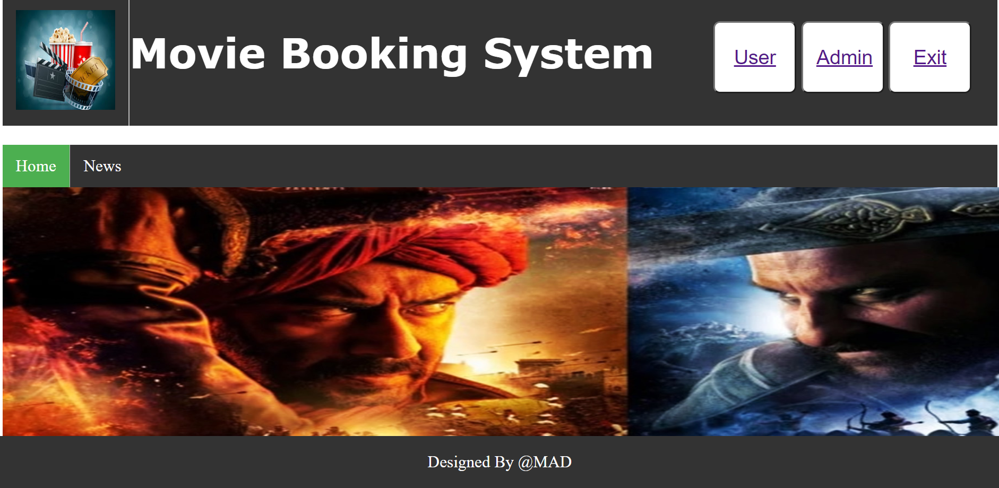
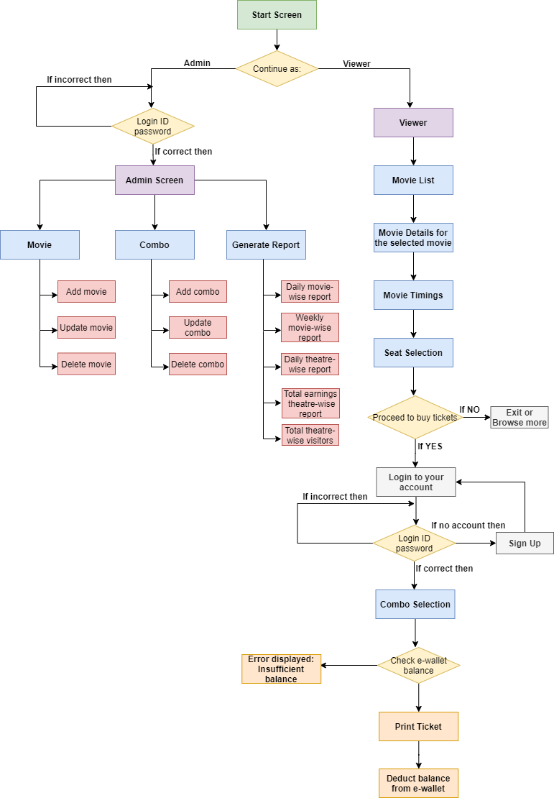
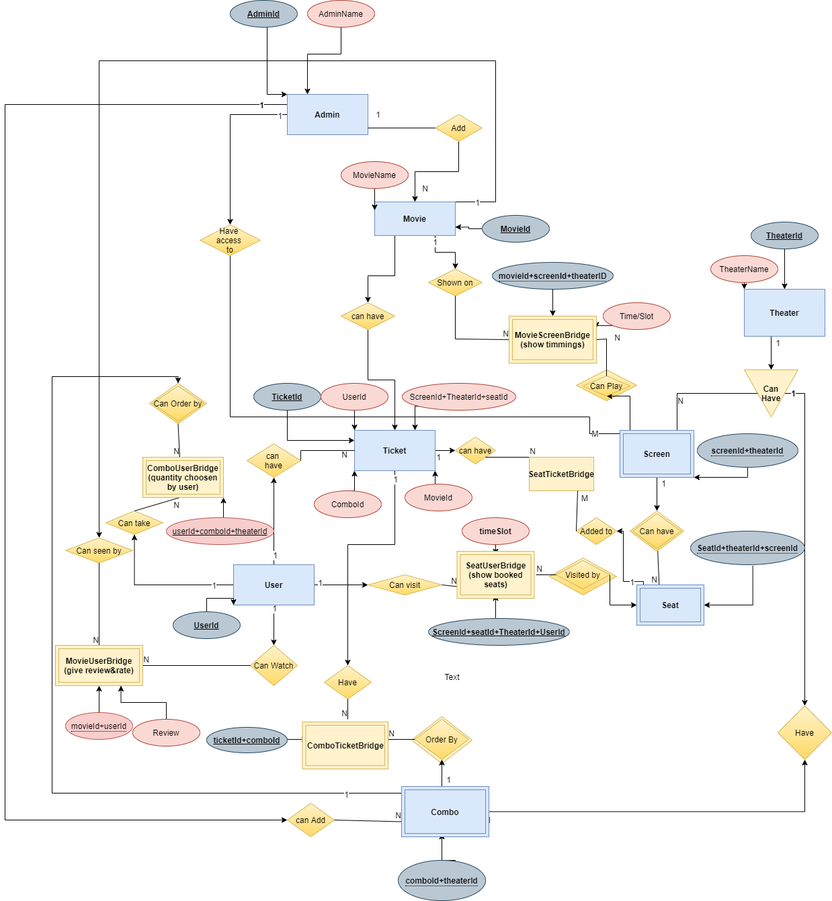

<h1 align = "center">
    Movie Ticket Booking System
</h1>

---

 

<p>

</p>

<h1>Table of Content</h1>

- [Introduction](#introduction)
- [Technology Stack](#technology-stack)
- [Installations and Running](#installations-and-running)
- [Contributors](#contributors)


## Introduction

---
Movie ticket booking system makes the task of booking tickets to watch movies easier and allows you to enjoy the movie-watching experience while sitting in seats of your choice and having your refreshments delivered to you at your seats.

## Flow of the system
---


---

## ER diagram of the system
---


## Technology Stack

---

- HTML/CSS/JavaScript
- Flask
- MySQL

## Running

---

- Clone this repository

  ```
  git clone https://github.com/DipikaPawar12/Movie-Ticket-Booking-System-using-python.git
  ```
 
- Here the main python file is trail.py. 
  ```
  venv/Scripts/trail.py
  ```
- In this project we had used MySQL database. whose connections are written here.
    ```
     #for mysql setup
     trail.config['MYSQL_HOST'] = 'localhost'            #local host name
     trail.config['MYSQL_USER'] = 'root'                 #your user name
     trail.config['MYSQL_PASSWORD'] = ''                 #your password
     trail.config['MYSQL_DB'] = 'movie'                  #Your database name
     trail.config['MYSQL_CURSORCLASS'] = 'DictCursor'

     # init MYSQL
     mysql = MySQL(trail)
    ```


## Contributors

---

| [Dipika Pawar](https://github.com/DipikaPawar12)                                                                                                            | [Aanshi Patwari](https://github.com/aanshi18)                                                                                                            | [Miracle Rindani](https://github.com/mrindani)                                                                                                |
